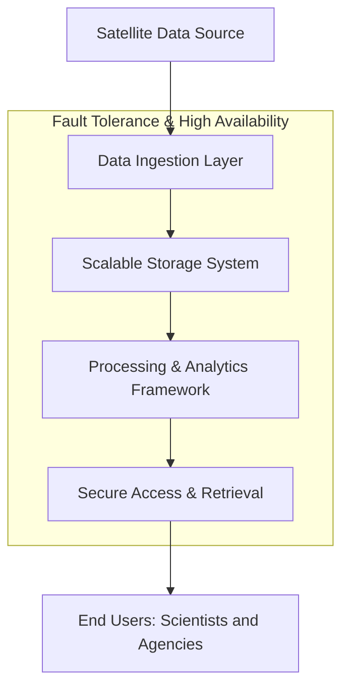

# Satellite Data Pipeline for Space Agencies

## 1. Problem Statement 

Design a large-scale data pipeline to process, store, and deliver satellite data (terabytes to petabytes). The system must be scalable, highly available, fault-tolerant, and secure, serving mission-critical applications for space agencies.

---

## 2. High-Level Architecture Diagram



---

## 3. Solution Components & Thought Process

### A. Data Ingestion Layer

**Function:** Real-time capture of raw satellite feeds.

**Design Choices:**
- Use distributed streaming platforms (e.g., Apache Kafka, AWS Kinesis).
- Support for high throughput and real-time delivery.

**Trade-offs:**
- Kafka offers great scalability but requires careful management of brokers.
- Kinesis is cloud-managed, but locks you into AWS.

---

### B. Scalable Storage System

**Function:** Store massive volumes efficiently.

**Design Choices:**
- Distributed file systems (e.g., HDFS, Ceph).
- Object storage (e.g., AWS S3, Google Cloud Storage).

**Trade-offs:**
- HDFS is robust for Hadoop ecosystem but can be complex to scale.
- Object storage is easy to scale but may have latency for large object retrieval.

---

### C. Processing & Analytics Framework

**Function:** Fast data transformation and analytics.

**Design Choices:**
- Use distributed computing (e.g., Apache Spark, Flink).
- Parallel processing for batch and streaming analytics.

**Trade-offs:**
- Spark is general-purpose but can be expensive for real-time streaming.
- Flink is optimized for streaming but less mature for batch workloads.

---

### D. Fault-Tolerant Architecture

**Function:** Ensure resilience and automated recovery.

**Design Choices:**
- Data replication across nodes.
- Checkpointing for recovery (e.g., Spark/Flink checkpoints).
- Automated failover mechanisms.

**Trade-offs:**
- More replication = higher storage cost.
- Frequent checkpoints = more compute overhead.

---

### E. High Availability Design

**Function:** Minimize downtime.

**Design Choices:**
- Load balancers (Nginx, HAProxy).
- Clustering for storage and compute nodes.
- Geo-distributed deployments for disaster recovery.

**Trade-offs:**
- Geo-distribution improves reliability but increases latency.
- Clustering adds operational complexity.

---

### F. Secure Access & Retrieval

**Function:** Role-based access for agencies/scientists.

**Design Choices:**
- Identity & Access Management (IAM) systems.
- Encryption at rest and in transit.

**Trade-offs:**
- Strict IAM policies can complicate usability.
- Encryption adds computational overhead.

---

## 4. Pseudocode Example

```plaintext
function ingestSatelliteData(stream):
    for packet in stream:
        if verify(packet):
            storeToDistributedFS(packet)
        else:
            logError(packet)

function processSatelliteData(storageLocation):
    dataChunks = readChunks(storageLocation)
    results = parallelMap(transform, dataChunks)
    saveResults(results)

function retrieveData(user, query):
    if hasPermission(user, query):
        return fetchData(query)
    else:
        raise AccessDenied
```

---

## 5. Submission Criteria Checklist

- **High-Level Diagrams:** Included above (Mermaid diagram).
- **Pseudocode:** Provided for key functions.
- **Thought Process & Trade-offs:** Explained for each component.
- **Research/References:** Technologies chosen based on industry standards (Kafka, S3, Spark, IAM).

---

## 6. References

- [Apache Kafka Documentation](https://kafka.apache.org/documentation/)
- [Amazon S3 Best Practices](https://docs.aws.amazon.com/AmazonS3/latest/userguide/best-practices.html)
- [Apache Spark Architecture](https://spark.apache.org/docs/latest/cluster-overview.html)
- [Identity and Access Management](https://cloud.google.com/iam/docs)

---

## 7. Conclusion

This solution balances scalability, reliability, security, and cost. Trade-offs are made for operational complexity versus ease of scaling and resilience. The technologies proposed are industry-proven and can be tailored to specific space agency needs.
